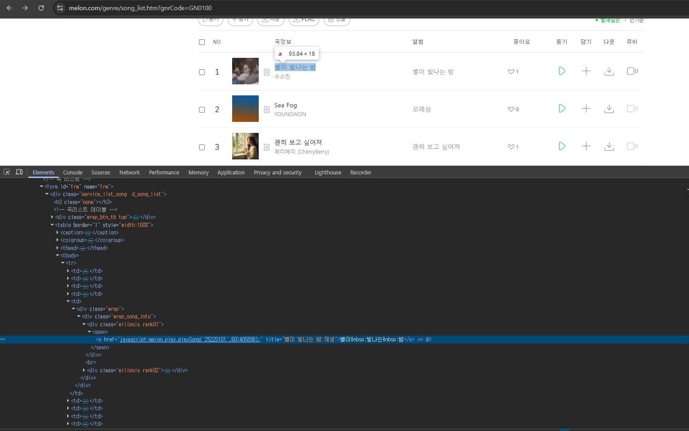
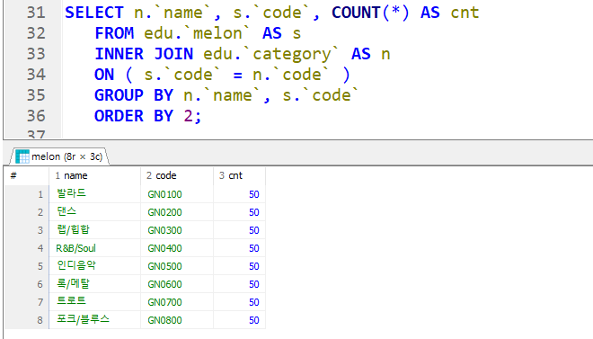

# 0303

 - study41 : beautifulsoup4 (bs4)
```bash
uv add beautifulsoup4 requests
```

## 주요 메서드 정리

| `메서드`| `설명` | `예시 |
| :---: | :---: | :---: |
| `find(tag_name, attrs={})` | 조건에 맞는 **첫 번째** 태그 찾기 | `soup.find('div', class_='content')` |
| `find_all(tag_name, attrs={})` | 조건에 맞는 **모든 태그** 리스트 반환 | `soup.find_all('a')` |
| `select(css_selector)` | **CSS 선택자**로 탐색 | `soup.select('div.article > h2')` |
| `select_one(css_selector)` | CSS 선택자로 **첫 번째 요소** 반환 | `soup.select_one('#main > p')` |
| `get_text(strip=True)` | 태그 내부의 **텍스트만 추출** | `element.get_text(strip=True)` |
| `get(attr_name)` | 속성 값 가져오기 | `link.get('href')` |


  ### app3.py 학습


```py
if res.status_code == 200:
    data = bs(res.text, 'lxml')
    # print(data)
    title = data.title.text
    trs = data.select("#frm tbody > tr")
    
    for i in range(len(trs)):
        arr.append(trs[i].select("td")[4].select_one("div[class='ellipsis rank01']").text.replace("\n", "").replace("\xa0", " ").strip()) # strip() : 여백 지우기 (양쪽 끝)

print(arr)
```

## Mariadb 구성하기

- Docker 볼륨 생성
```bash
docker volume create data-mariadb
```

- Docker Container 생성
```bash
docker run -d -p 3306:3306 -v data-mariadb:/var/lib/mysql -e MARIADB_ROOT_PASSWORD=1234 -e MARIADB_DATABASE=edu -e TZ=Asia/Seoul -e LC_ALL=en_US.UTF-8 --name mariadb mariadb:12.1.2
```

- Database Table 생성
```sql
CREATE TABLE `melon` (
	`id` 			INT 				  NOT NULL,
	`img` 		VARCHAR(255)	NULL,
	`title`		VARCHAR(100)	NOT NULL,
	`album`		VARCHAR(100)	NOT NULL,
	`cnt`			INT				    NOT NULL,
	`regDate`	DATETIME 		  NOT NULL DEFAULT CURRENT_TIMESTAMP,
	`modDate`	DATETIME			NOT NULL DEFAULT CURRENT_TIMESTAMP ON UPDATE CURRENT_TIMESTAMP
);
```

- Table Insert문
```python
sql = f"""
    INSERT INTO edu.`melon` 
    (`id`, `img`, `title`, `album`, `cnt`)
    VALUE
    ('{id}', '{img}', '{title}', '{album}', {cnt});
"""
```

- 장르 코드명
```sql
CREATE VIEW edu.`category` AS
SELECT 'GN0100' AS `code`, '발라드' AS `name`
UNION ALL
SELECT 'GN0200' AS `code`, '댄스' AS `name`
UNION ALL
SELECT 'GN0300' AS `code`, '랩/힙합' AS `name`
UNION ALL
SELECT 'GN0400' AS `code`, 'R&B/Soul' AS `name`
UNION ALL
SELECT 'GN0500' AS `code`, '인디음악' AS `name`
UNION ALL
SELECT 'GN0600' AS `code`, '록/메탈' AS `name`
UNION ALL
SELECT 'GN0700' AS `code`, '트로트' AS `name`
UNION ALL
SELECT 'GN0800' AS `code`, '포크/블루스' AS `name`;
```

- View 이용해서 보기
```sql
SELECT n.`name`, s.`code`, COUNT(*) AS cnt
	FROM edu.`melon` AS s
	INNER JOIN edu.`category` AS n
	ON ( s.`code` = n.`code` )
	GROUP BY n.`name`, s.`code`
	ORDER BY 2;
```


