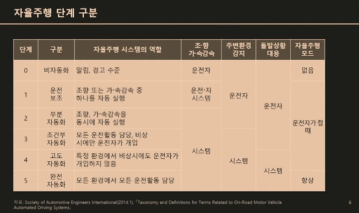

## 0310 STK 웨비나

 ### Session 1 : 글로벌 기술 트렌드, 피지컬 AI 전쟁
```bash
- Google Waymo - 자율주행 택시
2020.10부터 lv.4 운행
카메라 + 라이다(500~1000 넘는 고가의 장비 > 하나만 쓰는 것이 아니라 비용이 더 커짐) 센서 이용

- Tesla의 E2E 자율 주행
FSD(Supervised) / E2E 자율 주행 > 카메라만 이용 (이미 양산 중인 모델에 탑재된 상태)
Tesla의 Robotaxi 25/6

- 중국의 자율주행 신흥 강자들
Apollo ...
```

- 자율주행 단계 구분 (lv.0~5)


```bash
- 한국의 자율주행 서비스
자율주행자동차 상용화 촉진 및 지원에 관한 법률 - 제9조 - 2020/5/1시행

- 로봇
공장 로봇 -> 서비스 로봇

- 휴머노이드
기본적으로 비효율적일 수 있으나 이미 인간에 맞게 설계된 모든 것에 인간을 대신하여 사용성이 높을 수 있다.

- 피지컬 AI 시대 우려
사고 발생 시 책임은 누구의 문제인가
회사의 책임? 이용자의 책임? > 사회적 합의 필요

```